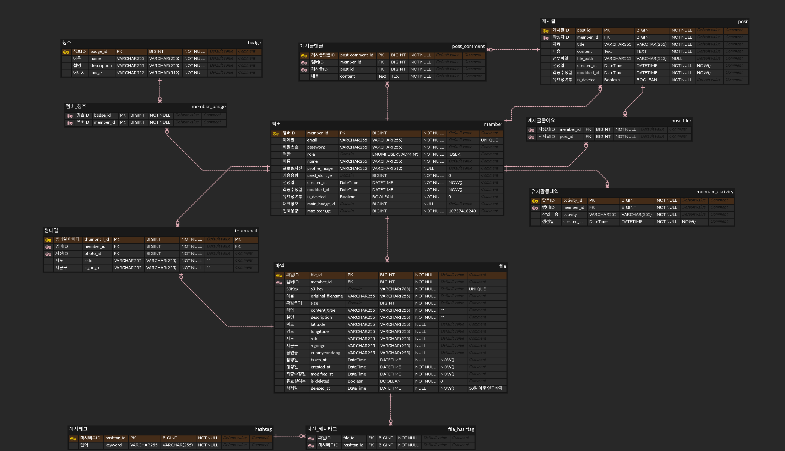
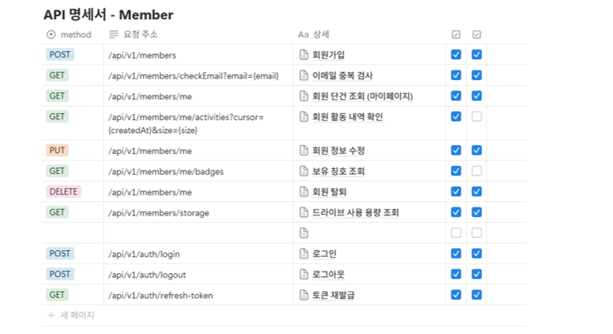
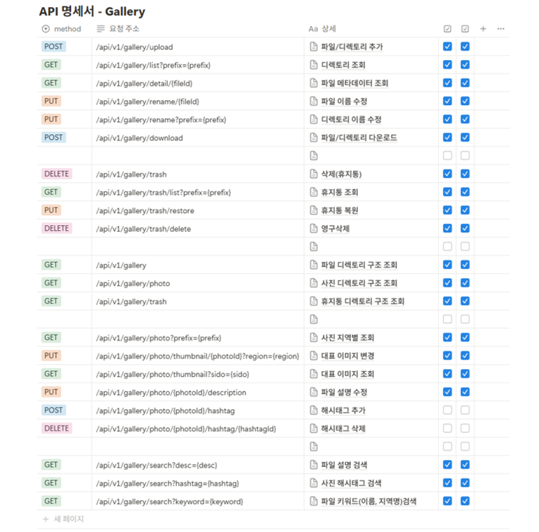
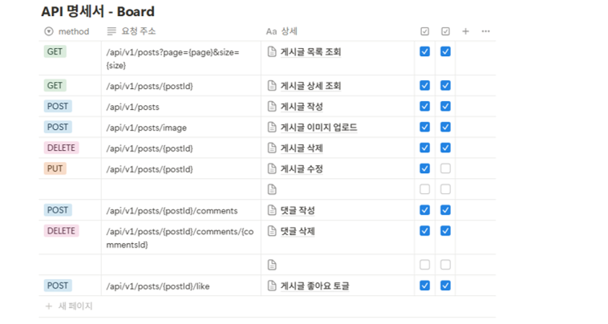
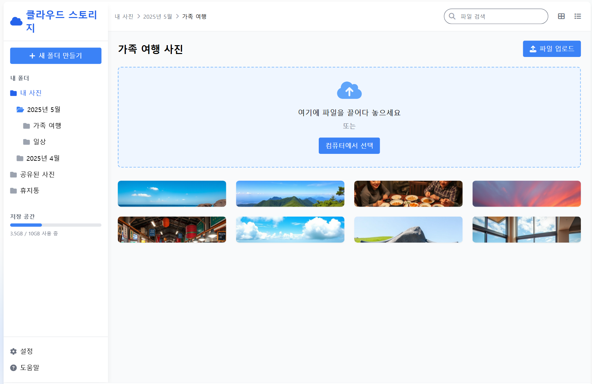
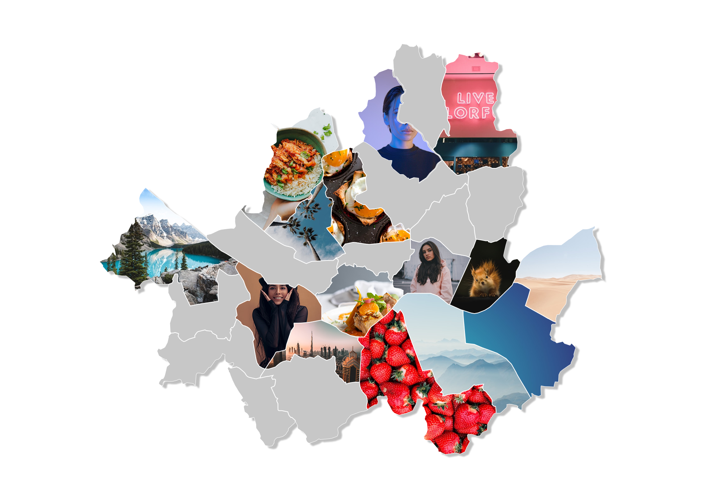

# TripCloud

TripCloud는 사진 기반 클라우드 프로젝트입니다.

스마트폰으로 사진을 몇 년간 찍다 보면 용량이 부족해지고, 이로 인해 사진을 다른 물리 저장소나 클라우드 저장소로 옮기는 일이 생깁니다. 그러나 수천 장의 사진을 따로 분류하지 않고 업로드할 경우, 시간이 흐른 뒤 다시 찾아보는 데 어려움이 큽니다.

TripCloud는 사용자가 사진을 따로 분류하지 않더라도, **위치 기반 자동 분류**를 통해 오랜 시간이 지나도 빠르게 원하는 사진을 찾아볼 수 있도록 돕는 **클라우드 저장 플랫폼**입니다.

---

## 주요 기능

### ✅ 사용자 인증


- 간편한 회원가입 및 로그인 기능 제공
- JWT 기반 인증 체계를 도입하여 확장성과 보안성 확보
- 로그인한 사용자는 마이페이지를 통해 내 정보 확인 및 수정 가능

### ✅ 파일 업로드 및 관리


- 이미지뿐만 아니라 **일반 파일도 업로드**
- **다중 파일 업로드**, **폴더 단위 업로드** 지원
- **파일/폴더 이름 수정** 기능
- **ZIP 다운로드** 지원

### ✅ 사진 전용 기능


- `contentType = image` 인 파일을 자동 분류하여 **사진 전용 뷰** 제공
- 사진에 대한 **설명글 추가** 가능
- **Gen AI 기반 키워드 자동 추출** 지원
- **키워드, 설명, 파일 이름 기반 검색** 기능 제공

### ✅ 지도 기반 분류 및 탐색


- 업로드된 사진의 메타데이터를 바탕으로 **시도/시군구별 자동 분류**
- **대표 이미지 자동 지정** (해당 지역 첫 사진 업로드 시 자동 지정)
- 사용자가 대표 이미지를 직접 선택 가능
- 지도를 채우며 사진을 탐색하는 **게이미피케이션 요소 제공**
- **방문 지역과 미방문 지역**에 대한 **관광지 추천 기능** 제공

### ✅ 정렬 및 삭제 관리


- 이름, 용량, 등록일 기준 **정렬 기능 제공**
- 삭제 시 **휴지통으로 이동** 후 **복원 또는 영구 삭제 가능**

### ✅ 이용자 커뮤니티 기능


- 사용자 간 소통을 위한 자유 게시판 제공
- 게시글에 대해 댓글 작성 및 좋아요 기능 제공
- 유저 참여를 유도하는 커뮤니티 중심의 소셜 기능 강화

---

## ERD

TripCloud의 데이터베이스는 다음과 같은 주요 엔티티들로 구성되어 있습니다:



### 📦 주요 테이블 설명 (Entity Summary)

#### 🧑‍💼 member (회원 정보)

- 사용자 계정 정보를 저장합니다.
- 이메일, 비밀번호, 이름, 프로필 이미지, 사용량, 보유 배지 등 포함
- main_badge_id로 대표 배지를 설정 가능
- 계정 삭제 여부와 최대 저장 용량도 관리

#### 📁 file (파일 정보)

- 업로드된 모든 파일(이미지, 일반 파일)의 메타데이터를 저장합니다.
- S3 키, 원본 파일명, 크기, MIME 타입 등 포함
- 사진일 경우 위치 정보(GPS, 행정구역), 촬영 일시 등도 저장
- GPS 정보는 암호화하여 저장
- 삭제된 파일은 is_deleted = true로 표시하여 휴지통 조회가 가능하고, 이후 복원과 영구 삭제 가능.

#### 🖼️ thumbnail (대표 지역 썸네일)

- 사용자가 방문한 시도/시군구 단위의 대표 이미지를 지정합니다.
- 지역별 첫 사진 업로드 시 자동 지정되며, 사용자 커스터마이징 가능
- member_id, sido, sigungu 조합은 유일해야 함

#### 🏷️ hashtag, file_hashtag (사진 키워드)

- AI로 추출된 사진 키워드(해시태그)를 저장하는 테이블
- 다대다 관계를 위한 연결 테이블 file_hashtag를 통해 파일과 키워드를 연결

#### 🧷 badge, member_badge (배지 시스템)

- 활동 성과에 따라 수여되는 배지를 저장
- member_badge를 통해 다대다 관계로 사용자에게 배지 부여

#### 🧾 post, post_comment, post_like (게시판)

- 자유게시판 기능 구현
- post: 글 제목, 내용, 첨부 이미지 경로 등을 저장
- post_comment: 게시글에 대한 댓글 저장
- post_like: 사용자의 게시글 좋아요 기록 저장

#### 📌 member_activity (유저 활동 로그)

- 사용자의 주요 활동 기록을 저장하는 로그 테이블
- 회원 가입, 사진 업로드, 게시글 작성 등 이벤트성 활동 저장

---

## API 명세서

### 🧑‍💼 Member API

- 회원가입, 로그인, 내 정보 조회 및 수정 등 사용자 인증 관련 API입니다.
  

---

### 📁 Gallery API

- 파일 업로드, 삭제, 정렬, 휴지통 처리, ZIP 다운로드 등 파일 관리 기능 관련 API입니다.
  

---

### 💬 Board API

- 게시글 작성, 수정, 삭제, 댓글, 좋아요 등 커뮤니티 기능과 관련된 API입니다.
  

---

### 🗺️ Attraction API

- 사용자의 위치 기반으로 관광지를 추천하고, 대표 이미지 등을 조회하는 기능의 API입니다.
  

---

## 시스템 구성도

### 1. **Frontend (Vue.js)**

- 사용자 인터페이스(UI)를 담당하는 SPA(Single Page Application)
- 사진 탐색, 폴더/파일 탐색, 사진 검색, 지도 기반 뷰, 커뮤니티 기능 등의 UX 처리
- Presigned URL로 MinIO에서 직접 이미지 조회
- 회원가입, 로그인, 마이페이지 등 JWT 기반 인증 흐름 구현
- Vue Router와 Pinia를 이용해 상태 관리 및 페이지 전환 수행

### 2. **Backend (Spring Boot)**

- TripCloud의 핵심 비즈니스 로직 및 REST API 서버
- 기능별 주요 책임:
- 사용자 인증 및 권한 처리 (JWT 기반)
- 파일/폴더 메타데이터 관리 및 삭제 복구
- 위치 정보(GPS 및 행정구역) 자동 분류 처리
- AI 키워드 추출 요청 처리 (예: BLIP 모델 등과 연동)
- 게시판, 댓글, 좋아요 등 커뮤니티 기능
- 관광지 추천 및 대표 썸네일 자동 지정
- MyBatis를 사용해 명확하고 효율적인 SQL 처리 구현

### 3. **MySQL**

- TripCloud의 영속성 계층으로 다음 데이터를 저장:
- 사용자 정보 (member)
- 파일/사진 메타데이터 (file)
- 키워드/설명/위치 정보 (hashtag, file_hashtag, thumbnail)-
- 커뮤니티 게시글, 댓글, 좋아요 (post, post_comment, post_like)-
- 사용자 활동 및 배지 시스템 (member_activity, badge)-
- 관광지 정보 및 추천 기능 (attraction)-
- 복잡한 관계형 구조를 명확하게 표현하고, 삭제/복원 등 상태 기반 관리도 수행-

### 4. **MinIO (S3 호환 오브젝트 스토리지)**

- 실제 이미지 및 일반 파일을 저장하는 오브젝트 스토리지
- 사용자는 Presigned URL을 통해 MinIO에서 파일을 직접 다운로드 또는 미리보기 가능
- 오픈소스 기반으로 온프레미스 구축 가능, 퍼블릭 클라우드 비용 없이 독립적인 파일 저장소 구축 가능
- AWS S3 API 호환 → 로컬 개발과 클라우드 이전이 모두 유연
- 썸네일, ZIP 다운로드, 폴더 업로드 등도 모두 객체 스토리지에서 처리

---

## 프로젝트 프로토타입

### 드라이브



### 지도 컴포넌트



---

## 실행 및 배포
### 🔧 환경 변수 설정
#### 📁 frontend/.env
```bash
VITE_API_BASE_URL=http://localhost:8080/api/v1
```

#### 📁 backend/.env
```bash
OPENAI_API_KEY=
KAKAO_REST_API_KEY=

DB_URL=
DB_USERNAME=
DB_PASSWORD=

MINIO_ENDPOINT=
MINIO_ENDPOINT_PUBLIC=
MINIO_ACCESS_KEY=
MINIO_SECRET_KEY=
MINIO_BUCKET=tripcloud

REDIS_PORT=
REDIS_HOST=
```


### 🛠️ 개발 시

```bash
# Frontend
cd frontend
npm install
npm run dev
```

```bash
# Backend
cd backend
./mvnw spring-boot:run
```

---

## 마무리

TripCloud는 사용자 중심의 클라우드 파일 저장소를 지향합니다. 단순한 저장소를 넘어, 사진을 즐기고, 관리하고, 탐험할 수 있는 플랫폼으로 나아가고 있습니다.
